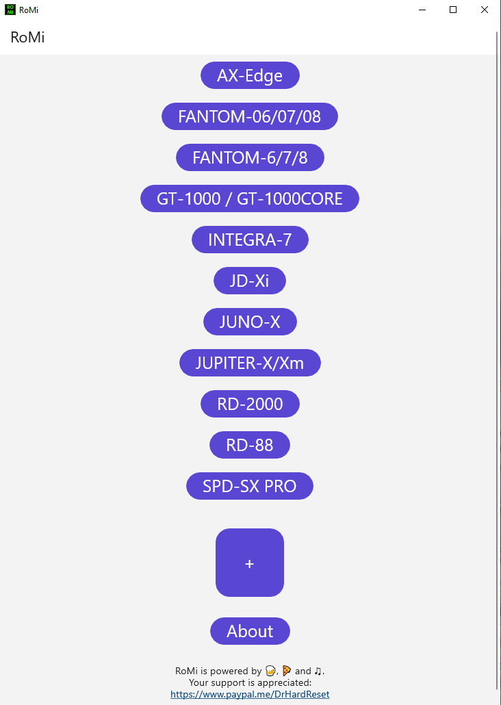

    

If you've ever wanted to control your Roland keyboard/synthesizer/workstation via MIDI and tried to calculate the sysex messages and checksum by just poking around the midi implementation charts, you know how time consuming and frustrating this can be.
RoMi (= Roland MIDI) is an app to improve and speed up this process as it automatically calculates the Sysex MIDI messages.

I got the idea for the app when I was trying to remote control my Roland AX-Edge and it took ages. I was wondering, why would I need to, in 2023, still do these calculations by hand? Well, there is no need to wonder anymore, because I can now present this RoMi app to you, that makes your life with your Roland device a lot easier. Goodbye manual work, hello automation!

Just download the RoMi app, insert the midi implementation PDF and you're good to go!
(Because I do not own the rights to the Roland PDFs, you need to download them yourself)

The app is tested for Roland AX-Edge but should work with RD-88, RD-2000 and FANTOM-06/07/08, too.

RoMi is licensed under the [GPLv3 License][license-link].

**If you'd like me to add more Roland models to be used with the app, just let me know: [RoMi discussions][discussions-link]**

I hope you'll find the app as useful as I do!

	
	

USED THIRD-PARTY LIBRARIES
==========================

The most important libraries which are used by RoMi:

* [uno][uno-link] – [Apache License, Version 2.0][uno-license-link]
* [PdfPig][pdfpig-link] – [Apache License, Version 2.0][pdfpig-license-link]
* [managed midi][managed-midi-link] – [MIT License][managed-midi-license-link]

See About page in the app for all used libraries.

Thanks to 
==========================
Eddie Lotter's [MIDI SysEx Tutorial][eddies-tutorial]

<!-- LINK GROUP -->
[discussions-link]: https://github.com/DrHardReset/RoMi/discussions
[license-link]: https://github.com/DrHardReset/RoMi/blob/main/LICENSE

[uno-link]: https://github.com/unoplatform/uno
[uno-license-link]: https://github.com/unoplatform/uno/blob/master/License.md
[pdfpig-link]: https://github.com/UglyToad/PdfPig
[pdfpig-license-link]: https://github.com/UglyToad/PdfPig/blob/master/LICENSE
[managed-midi-link]: https://github.com/atsushieno/managed-midi
[managed-midi-license-link]: https://github.com/mangstadt/ez-vcard/blob/master/LICENSE

[eddies-tutorial]: https://www.2writers.com/eddie/TutSysEx.htm

<meta name="google-site-verification" content="h6SAio2nQP0lnXGMGO2Bev2Gzd3Uc9nYzNHzMR2TdBQ" />